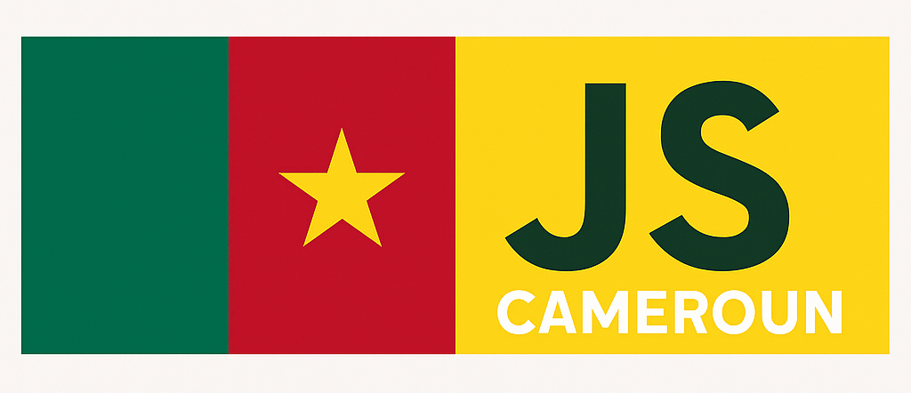

# Welcome to JavaScript Cameroun 🇨🇲

**JavaScript Cameroun** is a vibrant community dedicated to promoting learning, collaboration, and innovation around the JavaScript ecosystem — from the web to mobile and backend technologies. Whether you're just starting out or already an experienced developer, you're welcome to grow with us.

---

## Our Goals 🎯

- **Learning**: Help members master JavaScript, whether for the browser, Node.js, mobile (React Native), or full-stack development.
- **Sharing**: Build a local knowledge base with tutorials, blogs, and tech talks in both English and French.
- **Collaboration**: Connect Cameroonian developers through open-source projects and professional opportunities.

---

## Join the Community 🚀

- 💬 **Discussions**: [Telegram Group](#) *(coming soon)*
- 📅 **Events**: Meetups, workshops, hackathons, and livestreams.
- 👥 **Contributions**: Join our GitHub repos and help build amazing tools for the community.

---

## Maintainers 🤝

This project is proudly maintained by:

- [@ulrichpouani](https://github.com/ulrichpouani)  
- [@bleriotnoguia](https://github.com/bleriotnoguia)

---

Thank you for being part of this journey to elevate **JavaScript Cameroun** and shape the future of tech in 🇨🇲!
